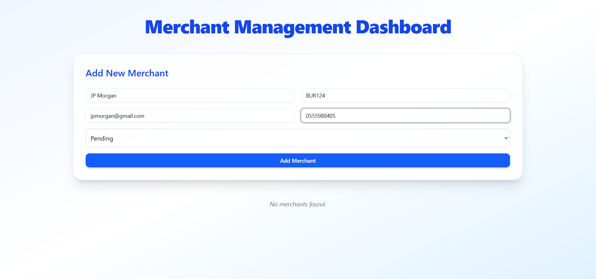

# Merchant Application

## Backend
### Tools
    - Postgresql for the database
    - Globalised number pacakage to make sure 0555, and +233 are not interpreted as different numbers
    - dotenv for storing and getting enviroment variables
    - docker and docker compose for containerizing application
    - Nginx for serving the app directly 
    - Pytest and Code coverage for showing detailed results on tests
    - github workflow for CI/CD  

| Method   | Endpoint              | Description                  |
| :------- | :-------------------- | :--------------------------- |
| `GET`    | `/api/merchant/`      | List all merchants           |
| `POST`   | `/api/merchant/`      | Create a new merchant        |
| `GET`    | `/api/merchant/{id}/` | Retrieve a specific merchant |
| `PUT`    | `/api/merchant/{id}/` | Update merchant details      |
| `DELETE` | `/api/merchant/{id}/` | Delete a merchant            |


## Frontend
### Tools
    - Tailwindcss for styling
    - docker for containerizing application

## Running Tests
```bash
    pytest --cov
```
## Running Application

### Recreate .env for backend and .env.local for frontend from the env samples
---

```bash 
    docker-compose up --build -d
```
# OR

## Run backend
    - install packages
    - pip install -r requirements.txt
    - Run application
    - python manage.py runserver 
    
### docker version, simulating a production ready environment of the backend runs with gunicorn 

## Run frontend
    - install packages
    - npm i 
    - Run application
    - npm run dev / npm start
    





